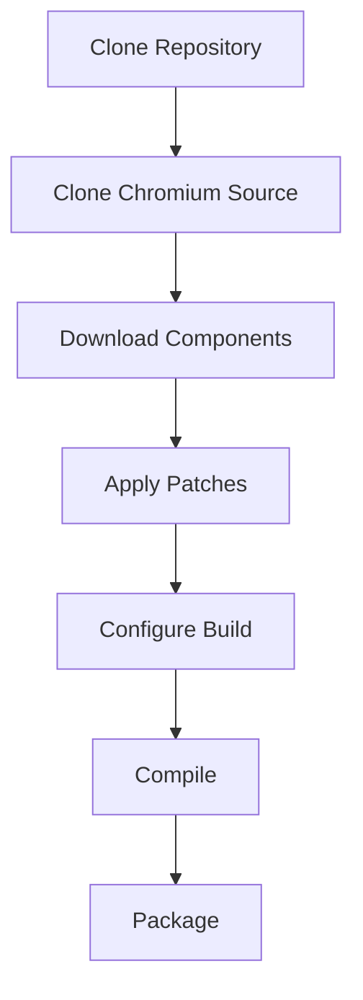

## Prerequisites

Before starting, ensure you meet all [build requirements](/development/requirements).

<Check>
**Quick Checklist:**
- [ ] 32GB+ RAM (16GB minimum)
- [ ] 100GB+ free disk space
- [ ] Python 3.8 or newer
- [ ] Git 2.30 or newer
- [ ] Platform-specific build tools installed
- [ ] 4-8 hours available for first build
</Check>

## Build Process Overview

Building Helium involves several stages:



## Step 1: Clone Helium Repository

First, clone the Helium source repository:

```bash
# Clone the repository
git clone https://github.com/imputnet/helium-source.git
cd helium-source
```

<Info>
This repository contains the patches, build configuration, and utilities needed to build Helium. The actual Chromium source will be downloaded in the next step.
</Info>

## Step 2: Clone Chromium Source

Use the provided `clone.py` utility to download Chromium source and all dependencies:

<CodeGroup>
```bash Linux
# Clone Chromium and dependencies (takes 30-60 minutes)
python3 utils/clone.py --output chromium
```

```bash macOS
# For Intel Macs
python3 utils/clone.py --output chromium --pgo mac

# For Apple Silicon Macs
python3 utils/clone.py --output chromium --pgo mac-arm
```

```powershell Windows
# Clone Chromium and dependencies
python utils/clone.py --output chromium --pgo win64
```
</CodeGroup>

### What This Does

The clone script performs several operations:

<Steps>
  <Step title="Clone Chromium Source">
    Downloads Chromium source at the specific version tag (145.0.7632.116) with depth=2
  </Step>
  
  <Step title="Set Up depot_tools">
    Clones and configures Chromium's build tools (depot_tools)
  </Step>
  
  <Step title="Clone gsutil">
    Sets up Google Cloud Storage utilities for downloading dependencies
  </Step>
  
  <Step title="Clone GN">
    Downloads the GN build file generator
  </Step>
  
  <Step title="Run gclient sync">
    Downloads all third-party dependencies and libraries
  </Step>
  
  <Step title="Download PGO Profiles">
    Fetches Profile-Guided Optimization profiles for better performance
  </Step>
  
  <Step title="Generate Version Headers">
    Creates version headers (LASTCHANGE, gpu_lists_version.h, etc.)
  </Step>
</Steps>

### Clone Options

<ParamField path="--output" type="string" default="chromium">
  Output directory for the cloned sources
</ParamField>

<ParamField path="--pgo" type="string" default="linux">
  PGO profile to download: `linux`, `mac`, `mac-arm`, `win32`, `win64`, `win-arm64`
</ParamField>

<ParamField path="--sysroot" type="string">
  Download a Linux sysroot: `amd64`, `arm64`, `armhf`, `i386`, `mips64el`, `mipsel`
</ParamField>

<ParamField path="--custom-config" type="string">
  Path to custom gclient config file (advanced)
</ParamField>

<Warning>
The clone process downloads **30+ GB** of data. Ensure you have:
- A stable internet connection
- Sufficient bandwidth quota
- Patience (30-60 minutes on a fast connection)
</Warning>

## Step 3: Download Additional Components

Download Helium-specific components:

```bash
# Create download cache directory
mkdir -p download_cache

# Download components
python3 utils/downloads.py retrieve \
  -i deps.ini \
  -c download_cache

# Unpack into source tree
python3 utils/downloads.py unpack \
  -i deps.ini \
  -c download_cache \
  chromium
```

### Downloaded Components

This downloads and verifies:

<AccordionGroup>
  <Accordion title="uBlock Origin" icon="shield-halved">
    **Version:** 1.69.0-2
    
    Pre-configured uBlock Origin extension that will be built as a component extension.
    
    - Custom filter lists
    - Helium Services integration
    - Optimized assets
  </Accordion>
  
  <Accordion title="Helium Onboarding" icon="hand-wave">
    **Version:** 202601021937
    
    The welcome page shown at `helium://setup` for new users.
    
    - Introduction to Helium features
    - Initial setup workflow
    - Search engine selection
  </Accordion>
  
  <Accordion title="Search Engine Data" icon="magnifying-glass">
    Prepopulated search engine configurations including icons and templates.
    
    - DuckDuckGo, Brave Search, Startpage
    - Google, Bing (with privacy warnings)
    - Regional search engines
  </Accordion>
</AccordionGroup>

### Hash Verification

All downloads are verified using SHA-256 checksums:

```bash
# Downloads are automatically verified
# If verification fails, you'll see:
ERROR: File checksum does not match: download_cache/ublock-origin-1.69.0-2.zip
```

<Tip>
If a download is interrupted, re-run the command. If `curl` is available, downloads will automatically resume from where they stopped.
</Tip>

## Step 4: Apply Patches

Apply all Helium patches to the Chromium source:

```bash
# Apply patches (takes 5-10 minutes)
python3 utils/patches.py apply chromium patches
```

### Patch Application Process

The patches are applied in order from `patches/series`:

1. **Upstream fixes** (48 patches) - Vertical tabs and other backported features
2. **Inox patches** (4 patches) - Privacy enhancements
3. **Iridium patches** (2 patches) - Disable tracking
4. **ungoogled-chromium** (46 patches) - Core privacy and de-googling
5. **Bromite patches** (3 patches) - Fingerprinting protection
6. **Brave patches** (4 patches) - Import functionality
7. **Helium patches** (171 patches) - Helium-specific features and UI

### Monitoring Progress

```bash
# You'll see output like:
* Applying upstream-fixes/missing-dependencies.patch (1/276)
* Applying upstream-fixes/vertical/r1568708-fix-crash-during-collapsed-tabgroup-drag.patch (2/276)
...
* Applying helium/ui/layout/vertical.patch (276/276)
```

### Troubleshooting Patch Failures

<Warning>
If a patch fails to apply:

```bash
# Check which files are causing conflicts
python3 utils/patches.py apply chromium patches --fuzz 0

# For dry-run to see what would fail:
from utils.patches import dry_run_check, find_and_check_patch
from pathlib import Path

for patch in Path('patches').glob('**/*.patch'):
    code, stdout, stderr = dry_run_check(patch, Path('chromium'))
    if code != 0:
        print(f"Failed: {patch}")
```

Contact the Helium team if patches consistently fail to apply.
</Warning>

## Step 5: Configure the Build

Generate the build configuration using GN:

<CodeGroup>
```bash Release Build (Recommended)
# Navigate to source directory
cd chromium

# Generate release build configuration
gn gen out/Default --args="
  import(\"//helium_args.gni\")
  is_debug=false
  is_official_build=true
  symbol_level=0
  "
```

```bash Debug Build
# Generate debug build for development
gn gen out/Debug --args="
  import(\"//helium_args.gni\")
  is_debug=true
  symbol_level=2
  "
```

```bash Custom Build
# Generate build with custom flags
gn gen out/Custom --args="
  import(\"//helium_args.gni\")
  is_debug=false
  is_official_build=true
  enable_nacl=false
  enable_widevine=false
  "
```
</CodeGroup>

### Build Configuration

Helium uses custom build flags defined in `flags.gn`:

```gn
# Core build settings
build_with_tflite_lib=false           # Disable TensorFlow Lite
chrome_pgo_phase=0                     # Use downloaded PGO profiles
clang_use_chrome_plugins=false         # Don't use Chromium plugins
disable_fieldtrial_testing_config=true # Disable A/B testing

# Feature flags
enable_hangout_services_extension=false  # No Hangouts
enable_mdns=false                        # No mDNS
enable_remoting=false                    # No Chrome Remote Desktop
enable_reporting=false                   # No crash reporting
enable_service_discovery=false           # No service discovery
enable_widevine=true                     # Keep Widevine DRM

# Privacy settings
safe_browsing_mode=0                   # Disable Safe Browsing

# Build optimizations
exclude_unwind_tables=true             # Reduce binary size
treat_warnings_as_errors=false         # Don't fail on warnings

# API keys (empty for privacy)
google_api_key=""
google_default_client_id=""
google_default_client_secret=""
use_official_google_api_keys=false
```

### Verifying Configuration

```bash
# List all build arguments
gn args out/Default --list

# Show specific argument value
gn args out/Default --list=enable_widevine

# Show all non-default values
gn args out/Default --short
```

## Step 6: Build Helium

Compile the browser using Ninja:

<CodeGroup>
```bash Full Build
# Build everything (2-8 hours first time)
cd chromium
ninja -C out/Default chrome
```

```bash Parallel Build
# Use specific number of parallel jobs (recommended for limited RAM)
ninja -C out/Default -j4 chrome
```

```bash Incremental Build
# After making changes, rebuild (much faster)
ninja -C out/Default chrome
```
</CodeGroup>

### Build Time Estimates

<CardGroup cols={2}>
  <Card title="First Build" icon="clock">
    **2-8 hours**
    
    - High-end workstation (16+ cores, 64GB RAM): 2-3 hours
    - Mid-range (8 cores, 32GB RAM): 4-6 hours
    - Lower-end (4 cores, 16GB RAM): 6-8 hours
  </Card>
  
  <Card title="Incremental Build" icon="forward-fast">
    **5-30 minutes**
    
    Rebuilds only changed files and their dependencies. Time varies based on scope of changes.
  </Card>
</CardGroup>

### Monitoring Build Progress

```bash
# Build with progress indication
ninja -C out/Default chrome -v

# In another terminal, monitor compilation
watch -n 5 "ps aux | grep 'clang\|link' | wc -l"
```

### Build Output

The compiled browser will be located at:

<Tabs>
  <Tab title="Linux">
    ```
    chromium/out/Default/chrome
    ```
    
    The main executable is `chrome`. Run with:
    ```bash
    ./out/Default/chrome
    ```
  </Tab>
  
  <Tab title="macOS">
    ```
    chromium/out/Default/Helium.app/
    ```
    
    macOS bundle. Run with:
    ```bash
    open out/Default/Helium.app
    ```
  </Tab>
  
  <Tab title="Windows">
    ```
    chromium\out\Default\chrome.exe
    ```
    
    The main executable. Run with:
    ```powershell
    .\out\Default\chrome.exe
    ```
  </Tab>
</Tabs>

### Common Build Issues

<AccordionGroup>
  <Accordion title="Out of Memory Errors" icon="memory">
    **Symptom:** Build crashes with "Killed" or memory errors during linking
    
    **Solutions:**
    ```bash
    # Reduce parallel jobs
    ninja -C out/Default -j2 chrome
    
    # Or use gold linker (Linux only)
    gn gen out/Default --args="...existing args... use_gold=true"
    
    # Or disable LTO (Link Time Optimization)
    gn gen out/Default --args="...existing args... use_thin_lto=false"
    ```
  </Accordion>
  
  <Accordion title="Compilation Errors" icon="triangle-exclamation">
    **Symptom:** Compilation fails with errors in modified code
    
    **Solutions:**
    ```bash
    # Ensure all patches were applied
    python3 utils/patches.py apply chromium patches
    
    # Check for conflicting local changes
    cd chromium
    git status
    git diff
    
    # Clean and rebuild
    rm -rf out/Default
    gn gen out/Default --args="..."
    ninja -C out/Default chrome
    ```
  </Accordion>
  
  <Accordion title="Slow Build Times" icon="snail">
    **Symptom:** Build takes much longer than expected
    
    **Solutions:**
    ```bash
    # Enable ccache
    gn gen out/Default --args="...existing args... cc_wrapper=\"ccache\""
    
    # Use all available cores
    ninja -C out/Default -j$(nproc) chrome
    
    # Disable debug symbols in release builds
    gn gen out/Default --args="...existing args... symbol_level=0"
    
    # Use faster linker (Linux)
    gn gen out/Default --args="...existing args... use_lld=true"
    ```
  </Accordion>
</AccordionGroup>

## Step 7: Run and Test

Run your newly built Helium browser:

```bash
# Linux
./out/Default/chrome

# macOS  
open out/Default/Helium.app

# Windows
.\out\Default\chrome.exe
```

### Testing Checklist

<Steps>
  <Step title="Launch Browser">
    Verify the browser launches without crashes
  </Step>
  
  <Step title="Check Branding">
    Confirm "Helium" branding appears correctly in UI and about page
  </Step>
  
  <Step title="Test uBlock Origin">
    Open `helium://extensions` and verify uBlock Origin is installed and active
  </Step>
  
  <Step title="Visit Test Sites">
    Test browsing functionality on various websites
  </Step>
  
  <Step title="Check Privacy Features">
    Use privacy testing sites to verify fingerprinting protection
  </Step>
</Steps>

## Next Steps

<CardGroup cols={2}>
  <Card title="Understanding Patches" icon="file-code" href="./patches">
    Learn how to work with and modify Helium patches
  </Card>
  
  <Card title="Development Workflow" icon="code" href="./overview">
    Return to the development overview
  </Card>
</CardGroup>

## Additional Resources

<CardGroup cols={2}>
  <Card title="Chromium Build Docs" icon="book" href="https://chromium.googlesource.com/chromium/src/+/main/docs/linux/build_instructions.md">
    Official Chromium build documentation
  </Card>
  
  <Card title="ungoogled-chromium" icon="github" href="https://github.com/ungoogled-software/ungoogled-chromium">
    Learn more about the base project
  </Card>
</CardGroup>