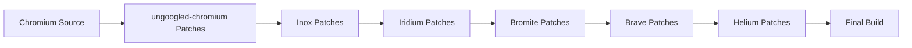

## Introduction

Helium is a privacy-focused Chromium-based web browser built on top of [ungoogled-chromium](https://github.com/ungoogled-software/ungoogled-chromium). This page provides an overview of the project architecture and development workflow.

## Architecture

Helium's architecture consists of several key components:

### Base Layer: Chromium

Helium is built on **Chromium version 145.0.7632.116**, providing a solid foundation with:
- Modern web standards support
- Security updates from the Chromium project
- Cross-platform compatibility (macOS, Linux, Windows)

### Privacy Layer: ungoogled-chromium

Built on ungoogled-chromium, Helium inherits:
- Removal of Google integration and dependencies
- Disabled automatic connections to Google services
- No crash reporting or metrics collection
- Removed binary blobs where possible

### Helium Enhancements

Helium adds its own features and modifications:

<CardGroup cols={2}>
  <Card title="Privacy Features" icon="shield">
    - Canvas, audio, and hardware fingerprinting noise
    - Reduced Accept-Language headers
    - Disabled ad topics and privacy sandbox
    - Client hints removal
  </Card>
  
  <Card title="UI Improvements" icon="palette">
    - Custom color scheme and theming
    - Redesigned toolbar and tabs
    - Cleaner new tab page
    - Removed unnecessary UI elements
  </Card>
  
  <Card title="Integrated Components" icon="puzzle-piece">
    - uBlock Origin as a built-in component
    - Helium Services integration
    - Custom onboarding experience
    - Native bang support
  </Card>
  
  <Card title="Browser Behavior" icon="sliders">
    - Parallel downloading enabled
    - Infinite tab freezing for memory savings
    - MRU tab cycling
    - Split view support
  </Card>
</CardGroup>

## Patch-Based Development

Helium uses a **patch-based development model** inherited from ungoogled-chromium:



### Patch Categories

Patches are organized by source and purpose:

<AccordionGroup>
  <Accordion title="upstream-fixes" icon="wrench">
    Fixes from Chromium upstream, particularly for vertical tabs and other features backported to the current version.
  </Accordion>
  
  <Accordion title="ungoogled-chromium" icon="ghost">
    Core privacy patches that disable Google services, telemetry, and tracking. These form the foundation of Helium's privacy features.
  </Accordion>
  
  <Accordion title="helium/core" icon="atom">
    Core Helium functionality including services integration, branding, search engine configuration, and feature flags.
  </Accordion>
  
  <Accordion title="helium/ui" icon="paintbrush">
    User interface modifications including layout changes, color schemes, toolbar redesign, and visual improvements.
  </Accordion>
  
  <Accordion title="helium/settings" icon="gear">
    Settings page modifications to remove unnecessary options and add Helium-specific configurations.
  </Accordion>
</AccordionGroup>

## Build System

Helium uses the standard Chromium build system with customizations:

### GN (Generate Ninja)

Build configuration is defined in `flags.gn`:

```gn
build_with_tflite_lib=false
chrome_pgo_phase=0
clang_use_chrome_plugins=false
disable_fieldtrial_testing_config=true
enable_widevine=true
safe_browsing_mode=0
treat_warnings_as_errors=false
```

### Ninja

The actual build is performed by Ninja, a fast parallel build system.

### Python Utilities

Helium includes custom Python utilities for:
- **clone.py** - Cloning Chromium source with dependencies
- **patches.py** - Applying GNU Quilt-formatted patches
- **downloads.py** - Downloading and verifying additional components

## Platform Packaging

Helium is packaged separately for each platform:

<CardGroup cols={3}>
  <Card title="macOS" icon="apple" href="https://github.com/imputnet/helium-macos">
    Universal binary with auto-updates
  </Card>
  
  <Card title="Linux" icon="linux" href="https://github.com/imputnet/helium-linux">
    AppImage format for wide compatibility
  </Card>
  
  <Card title="Windows" icon="windows" href="https://github.com/imputnet/helium-windows">
    Standalone installer
  </Card>
</CardGroup>

## Development Workflow

The typical development workflow involves:

<Steps>
  <Step title="Clone Source">
    Use `clone.py` to download Chromium source and dependencies
  </Step>
  
  <Step title="Download Components">
    Use `downloads.py` to retrieve uBlock Origin, onboarding page, and search engine data
  </Step>
  
  <Step title="Apply Patches">
    Use `patches.py` to apply all patches in the correct order from `patches/series`
  </Step>
  
  <Step title="Configure Build">
    Generate build files with GN using the configuration in `flags.gn`
  </Step>
  
  <Step title="Build">
    Compile the browser using Ninja
  </Step>
  
  <Step title="Test & Package">
    Test the build and create platform-specific packages
  </Step>
</Steps>

## Related Repositories

<CardGroup cols={2}>
  <Card title="Helium Services" icon="server" href="https://github.com/imputnet/helium-services">
    Backend services for extension proxying and updates
  </Card>
  
  <Card title="Helium Onboarding" icon="hand-wave" href="https://github.com/imputnet/helium-onboarding">
    Welcome page shown at `helium://setup`
  </Card>
  
  <Card title="uBlock Origin CRX" icon="shield-halved" href="https://github.com/imputnet/ublock-origin-crx">
    Packaging repository for uBlock Origin integration
  </Card>
</CardGroup>

## Continuous Integration

Helium uses Cirrus CI for automated testing:

- **Code quality checks** - yapf formatting and pylint linting
- **Configuration validation** - Verify config files are valid
- **Patch validation** - Test that all patches apply cleanly
- **Build verification** - Ensure the source tree builds successfully

<Note>
The CI pipeline runs on containers with 8 CPU cores and 32GB memory to handle Chromium's large codebase.
</Note>