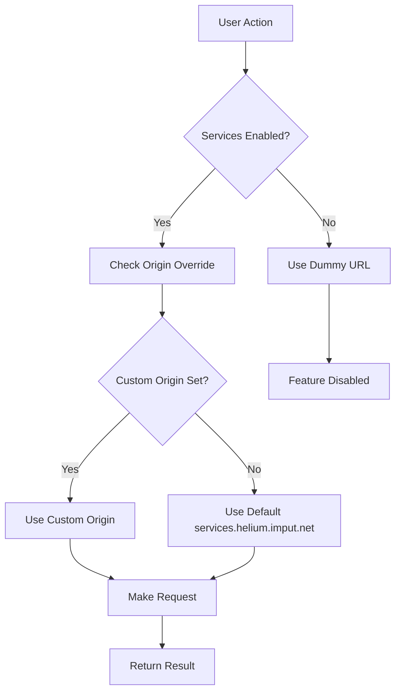

Helium is a privacy-focused Chromium-based web browser built on top of ungoogled-chromium. This page provides an overview of how Helium is structured and how its various components interact.

## Core Architecture

<CardGroup cols={2}>
  <Card title="Chromium Base" icon="chrome" href="/reference/chromium-base">
    The foundation built on ungoogled-chromium
  </Card>
  <Card title="Helium Services" icon="server" href="/reference/helium-services">
    Privacy-respecting backend services
  </Card>
  <Card title="Onboarding System" icon="rocket" href="/reference/onboarding">
    First-run experience and setup
  </Card>
  <Card title="Patch System" icon="code">
    Organized patches for customization
  </Card>
</CardGroup>

## Layer Structure

Helium is built in layers, with each layer adding functionality while preserving privacy:

<Steps>
  <Step title="Chromium Core">
    The base Chromium browser provides the rendering engine, JavaScript runtime, and core web platform features.
  </Step>
  <Step title="ungoogled-chromium">
    Removes Google dependencies and integrations, providing a clean foundation for privacy-focused browsing.
  </Step>
  <Step title="Helium Patches">
    Custom modifications organized into functional categories that implement Helium's features and design.
  </Step>
  <Step title="Helium Services">
    Optional backend services that provide additional functionality while respecting user privacy.
  </Step>
</Steps>

## Patch Organization

Helium's customizations are organized into distinct categories, each stored in the `patches/helium/` directory:

<AccordionGroup>
  <Accordion title="Core Patches" icon="cpu">
    Core functionality and behavior modifications:
    
    - **Branding**: Chrome to Helium branding changes
    - **Search**: Search engine configuration and native bang support
    - **Noise**: Privacy features (canvas, audio, hardware fingerprinting)
    - **Services**: Helium services integration and schema management
    - **Components**: uBlock Origin integration and component updates
    - **Policies**: Helium Opinionated Policies (HOP) system
    - **Default preferences**: Privacy-first default settings
  </Accordion>

  <Accordion title="UI Patches" icon="palette">
    User interface customizations:
    
    - **Toolbar**: Compact toolbar with custom button configuration
    - **Tabs**: Tab styling and behavior
    - **Layout**: Multiple layout modes (compact, vertical)
    - **Color scheme**: Helium's visual identity
    - **New Tab Page**: Cleaned up, minimalist NTP
    - **Omnibox**: Address bar enhancements
    - **Context menus**: Streamlined right-click menus
    - **Side panel**: Custom side panel integration
  </Accordion>

  <Accordion title="Settings Patches" icon="sliders">
    Settings page modifications:
    
    - **Privacy page**: Enhanced privacy controls
    - **Helium services page**: Service configuration interface
    - **Search engine management**: Improved search settings
    - **Appearance**: UI customization options
    - **Removed sections**: Cleanup of Google-specific features
    - **Reordered navigation**: More logical settings organization
  </Accordion>

  <Accordion title="HOP (Helium Opinionated Policies)" icon="shield">
    Privacy and security policies:
    
    - Custom policy provider with highest priority
    - Default security settings enforcement
    - Password manager configuration
    - WebRTC privacy controls
  </Accordion>
</AccordionGroup>

## Key Components

### uBlock Origin Integration

Helium includes uBlock Origin as a built-in component extension:

- Installed automatically as a component (not from Chrome Web Store)
- Preconfigured with privacy-focused defaults
- Filter list updates proxied through Helium services
- Integrated into settings UI for easy management

**Source files**: `~/workspace/source/patches/helium/core/ublock-*.patch`

### Helium Services Component

The services system provides optional functionality while preserving privacy:

<Note>
  All services are **opt-in** during onboarding and can be disabled at any time in settings.
</Note>

- **Extension updates**: Privacy-respecting extension update checks
- **Browser updates**: Automatic update notifications
- **Spellcheck**: Dictionary downloads
- **uBlock assets**: Proxied filter list updates
- **Native bangs**: DuckDuckGo-style search shortcuts

**Source files**: `~/workspace/source/patches/helium/core/services-*.patch`

### Schema Versioning System

Helium implements a schema versioning system to notify users of important changes to services behavior:

```cpp
inline constexpr int kHeliumCurrentSchemaVersion = 1;
```

When the schema version is incremented, users see a notification explaining the changes before they take effect. This ensures transparency about how Helium services work.

**Source files**: `~/workspace/source/components/helium_services/schema.cc`

## Build System Integration

Helium uses a dependency management system in `deps.ini` for external components:

<CodeGroup>
```ini deps.ini
[onboarding]
version = 202601021937
url = https://github.com/imputnet/helium-onboarding/releases/download/%(version)s/helium-onboarding-%(version)s.tar.gz
output_path = ./components/helium_onboarding

[ublock_origin]
version = 1.69.0-2
url = https://github.com/imputnet/uBlock/releases/download/%(version)s/uBlock0_%(version)s.chromium.zip
output_path = third_party/ublock
```
</CodeGroup>

These components are downloaded during the build process and integrated into Helium.

## Data Flow



All service requests are:
- **Conditional**: Only made when explicitly enabled by user
- **Configurable**: Users can self-host services
- **Privacy-respecting**: No tracking or telemetry
- **Transparent**: Schema changes require user acknowledgment

## Platform Packaging

Helium is packaged separately for each platform:

<CardGroup cols={3}>
  <Card title="macOS" icon="apple">
    [helium-macos](https://github.com/imputnet/helium-macos)
  </Card>
  <Card title="Linux" icon="linux">
    [helium-linux](https://github.com/imputnet/helium-linux)
  </Card>
  <Card title="Windows" icon="windows">
    [helium-windows](https://github.com/imputnet/helium-windows)
  </Card>
</CardGroup>

Each platform repository contains platform-specific packaging and build scripts while using this source repository as the base.

## Next Steps

<CardGroup cols={2}>
  <Card title="Chromium Base" icon="chrome" href="/reference/chromium-base">
    Learn about ungoogled-chromium foundation
  </Card>
  <Card title="Helium Services" icon="server" href="/reference/helium-services">
    Deep dive into services architecture
  </Card>
</CardGroup>