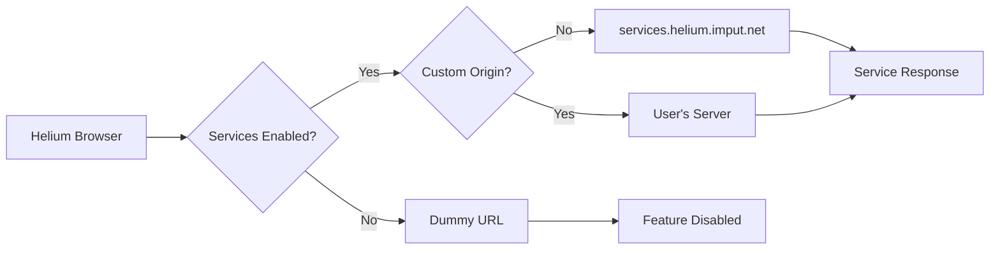

Helium Services provide optional functionality like extension updates, browser updates, and filter list management while respecting user privacy. All services are **opt-in** and **self-hostable**.

<Note>
  **Privacy First**: Helium services are completely optional. The browser works fully offline when services are disabled.
</Note>

## Architecture Overview



## Core Components

<CardGroup cols={2}>
  <Card title="Service Registry" icon="database">
    Centralized preference-based service configuration
  </Card>
  <Card title="Schema Versioning" icon="code-branch">
    User notification system for behavior changes
  </Card>
  <Card title="URL Builder" icon="link">
    Dynamic URL construction based on preferences
  </Card>
  <Card title="Settings UI" icon="sliders">
    User-facing service management interface
  </Card>
</CardGroup>

## Service Types

### 1. Extension Updates

Provides privacy-respecting extension update checks:

```cpp
GURL GetExtensionUpdateURL(const PrefService& prefs) {
    if (!ShouldAccessExtensionService(prefs)) {
        return GetDummyURL();
    }
    return GetServicesBaseURL(prefs).Resolve("/extensions/update");
}
```

**Features**:
- No tracking or analytics
- Only checks for user-installed extensions
- Respects user privacy preferences
- Can be completely disabled

**Preference**: `helium.services.extension_updating`

### 2. Browser Updates

Automatic browser update notifications:

```cpp
GURL GetBrowserUpdateURL(const PrefService& prefs) {
    if (!ShouldAccessUpdateService(prefs)) {
        return GetDummyURL();
    }
    // Platform-specific URL construction
    return GetServicesBaseURL(prefs).Resolve("/updates/browser/...");
}
```

**Platform Support**:
- ✅ macOS: Full auto-update support
- ✅ Linux: Update notifications (manual install via package manager)
- 🔄 Windows: In development

**Preference**: `helium.services.update_fetching_enabled`

### 3. uBlock Origin Assets

Proxied filter list updates:

```cpp
GURL GetUBlockAssetsURL(const PrefService& prefs) {
    if (!ShouldAccessUBlockAssets(prefs)) {
        return GetDummyURL();
    }
    return GetServicesBaseURL(prefs).Resolve("/ubo/assets.json");
}
```

<Accordion title="How uBlock Integration Works">
  1. **Default lists** are bundled with Helium and loaded from local storage
  2. **When services enabled**: Lists are updated via proxied requests through Helium services
  3. **Privacy benefit**: Filter list providers don't see user IP addresses
  4. **Optional lists**: User-added lists are fetched directly (not proxied)
</Accordion>

**Source**: `~/workspace/source/patches/helium/core/ublock-helium-services.patch`

**Preference**: `helium.services.ublock_assets`

### 4. Native Bangs

DuckDuckGo-style search shortcuts:

- `!g query` → Google search
- `!gh query` → GitHub search
- `!w query` → Wikipedia search

Bangs are processed client-side when possible, with fallback to services for comprehensive support.

**Preference**: `helium.services.bangs_enabled`

### 5. Spellcheck Dictionaries

Downloads language dictionaries for spell checking:

```cpp
GURL GetSpellcheckURL(const PrefService& prefs) {
    if (!ShouldAccessServices(prefs)) {
        return GetDummyURL();
    }
    return GetServicesBaseURL(prefs).Resolve("/spellcheck/...");
}
```

**Preference**: `helium.services.spellcheck_files`

## Schema Versioning System

Helium uses a schema versioning system to ensure users are informed about service behavior changes.

### Current Schema Version

```cpp
inline constexpr int kHeliumCurrentSchemaVersion = 1;
```

**Source**: `~/workspace/source/components/helium_services/schema.h:737`

### How It Works

<Steps>
  <Step title="Schema Version Increment">
    When services behavior changes significantly, the schema version is incremented.
  </Step>
  <Step title="User Notification">
    User sees a notification in the app menu and settings page explaining the changes.
  </Step>
  <Step title="Pending State">
    Changes are not active until the user acknowledges the notification.
  </Step>
  <Step title="Acknowledgment">
    User reviews changes and clicks "Got it" to accept the new schema version.
  </Step>
</Steps>

### Notification UI

When schema changes are pending:

<CardGroup cols={2}>
  <Card title="App Menu Badge" icon="bell">
    "Services updated" label appears on the app menu button
  </Card>
  <Card title="Settings Alert" icon="exclamation-triangle">
    Prominent notification on the Helium services settings page
  </Card>
</CardGroup>

### Changelog Example

```cpp
static constexpr auto kHeliumSchemaChangelog =
    base::MakeFixedFlatMap<int, std::string_view>({
        {
          1,
          "Automatic component updates are now available. "
          "They're managed by the same toggle that enables automatic browser updates.\n"
          "From now on, you'll be notified about major changes to Helium services. "
          "Even though these notifications are extremely rare, you can choose to "
          "ignore them and accept all future changes automatically."
        }
    });
```

**Source**: `~/workspace/source/components/helium_services/schema.cc:708-716`

## Service Configuration

### Default Origin

```cpp
const char kHeliumDefaultOrigin[] = "https://services.helium.imput.net";
```

All services are hosted at this domain by default.

### Custom Origin

Users can self-host Helium services:

<Steps>
  <Step title="Open Settings">
    Navigate to Settings → Privacy and security → Helium services
  </Step>
  <Step title="Enter Custom URL">
    Input your self-hosted origin in the "Use your own instance" field
  </Step>
  <Step title="Validation">
    Only HTTPS URLs (or localhost for development) are accepted
  </Step>
  <Step title="Apply">
    Services immediately switch to your custom origin
  </Step>
</Steps>

<Warning>
  **Security Warning**: Only use custom origins you control. Never paste URLs from untrusted sources.
</Warning>

### Origin Validation

```cpp
std::optional<GURL> GetValidUserOverridenURL(std::string_view user_url_) {
    if (user_url_.empty()) {
        return std::nullopt;
    }
    
    GURL user_url = GURL(user_url_);
    if (!user_url.is_valid()) {
        return std::nullopt;
    }
    
    bool isSecure = user_url.SchemeIs(url::kHttpsScheme) || 
                    net::IsLocalhost(user_url);
    if (!isSecure) {
        return std::nullopt;
    }
    
    return user_url;
}
```

**Source**: `~/workspace/source/components/helium_services/helium_services_helpers.cc:486-502`

## Preferences

All service preferences are stored in the user's profile:

<AccordionGroup>
  <Accordion title="Master Toggle" icon="toggle-on">
    **Preference**: `helium.services.enabled`  
    **Type**: Boolean  
    **Default**: `true`  
    **Description**: Master switch for all Helium services
  </Accordion>

  <Accordion title="Custom Origin" icon="server">
    **Preference**: `helium.services.origin_override`  
    **Type**: String  
    **Default**: `""` (empty)  
    **Description**: Custom self-hosted origin URL
  </Accordion>

  <Accordion title="Schema Version" icon="code-branch">
    **Preference**: `helium.services.schema_version`  
    **Type**: Integer  
    **Default**: `0`  
    **Description**: Last acknowledged schema version
  </Accordion>

  <Accordion title="Disable Schema Alerts" icon="bell-slash">
    **Preference**: `helium.services.disable_schema_alerts`  
    **Type**: Boolean  
    **Default**: `false`  
    **Description**: Auto-accept all future schema changes
  </Accordion>

  <Accordion title="Individual Services" icon="list">
    - `helium.services.extension_updating` (Boolean)
    - `helium.services.update_fetching_enabled` (Boolean)
    - `helium.services.ublock_assets` (Boolean)
    - `helium.services.bangs_enabled` (Boolean)
    - `helium.services.spellcheck_files` (Boolean)
  </Accordion>
</AccordionGroup>

**Source**: `~/workspace/source/components/helium_services/pref_names.h`

## Settings UI Implementation

The Helium services settings page is implemented as a Polymer component:

<Tabs>
  <Tab title="HTML Template">
    ```html
    <settings-toggle-button id="servicesToggleButton"
        pref="{{prefs.helium.services.enabled}}"
        label="$i18n{heliumServicesToggle}"
        sub-label="$i18n{heliumServicesToggleDescription}">
    </settings-toggle-button>
    ```
    **Source**: `~/workspace/source/chrome/browser/resources/settings/privacy_page/services_page.html:229-233`
  </Tab>

  <Tab title="TypeScript Logic">
    ```typescript
    export class SettingsHeliumServicesPageElement extends
        SettingsHeliumServicesPageElementBase {
      
      private changeProxy_: HeliumServicesChangeHandler =
          HeliumServicesChangeHandlerImpl.getInstance();
      
      private onAcknowledgedChangelog_() {
        this.changeProxy_.acknowledgeChanges(this.ignoreChecked_);
        this.requestChangelog();
      }
    }
    ```
    **Source**: `~/workspace/source/chrome/browser/resources/settings/privacy_page/services_page.ts:296-338`
  </Tab>

  <Tab title="Backend Handler">
    ```cpp
    void HeliumServicesSchemaHandler::HandleChangelogRequest(
        const base::Value::List& args) {
      base::Value::List out;
      
      if (helium::ShouldShowSchemaNotification(*pref_service_)) {
        int user_version = pref_service_->GetInteger(prefs::kHeliumSchemaVersion);
        auto& changelog = helium::GetChangelog();
        
        for (auto it = changelog.upper_bound(user_version); 
             it != changelog.end(); ++it) {
          out.Append(it->second);
        }
      }
      
      ResolveJavascriptCallback(base::Value(callback_id), std::move(out));
    }
    ```
    **Source**: `~/workspace/source/chrome/browser/ui/webui/settings/services_schema_handler.cc:798-815`
  </Tab>
</Tabs>

## Privacy Guarantees

<CardGroup cols={2}>
  <Card title="No Tracking" icon="eye-slash">
    Services don't log IP addresses, user agents, or create persistent identifiers
  </Card>
  <Card title="No Analytics" icon="chart-line">
    No usage statistics or telemetry collected
  </Card>
  <Card title="Minimal Data" icon="minimize">
    Only necessary information sent (e.g., extension ID for updates)
  </Card>
  <Card title="Open Source" icon="code">
    Services implementation will be published at [helium-services](https://github.com/imputnet/helium-services)
  </Card>
</CardGroup>

## Self-Hosting Guide

To host your own Helium services instance:

<Steps>
  <Step title="Clone Repository">
    ```bash
    git clone https://github.com/imputnet/helium-services
    cd helium-services
    ```
  </Step>
  <Step title="Configure Environment">
    Set up your environment variables and configuration
  </Step>
  <Step title="Deploy">
    Deploy to your server with HTTPS enabled
  </Step>
  <Step title="Configure Browser">
    Enter your origin in Helium settings → Helium services
  </Step>
</Steps>

<Note>
  Self-hosting documentation is available in the [helium-services repository](https://github.com/imputnet/helium-services).
</Note>

## Next Steps

<CardGroup cols={2}>
  <Card title="Architecture Overview" icon="sitemap" href="/reference/architecture">
    See how services fit into Helium's architecture
  </Card>
  <Card title="Onboarding System" icon="rocket" href="/reference/onboarding">
    Learn how users consent to services during setup
  </Card>
</CardGroup>